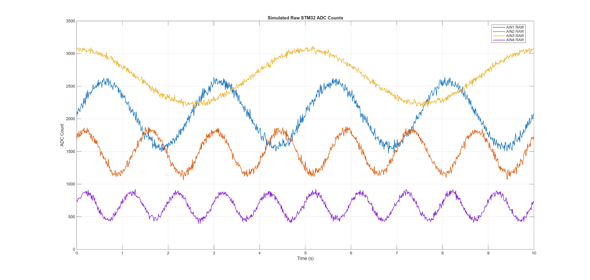
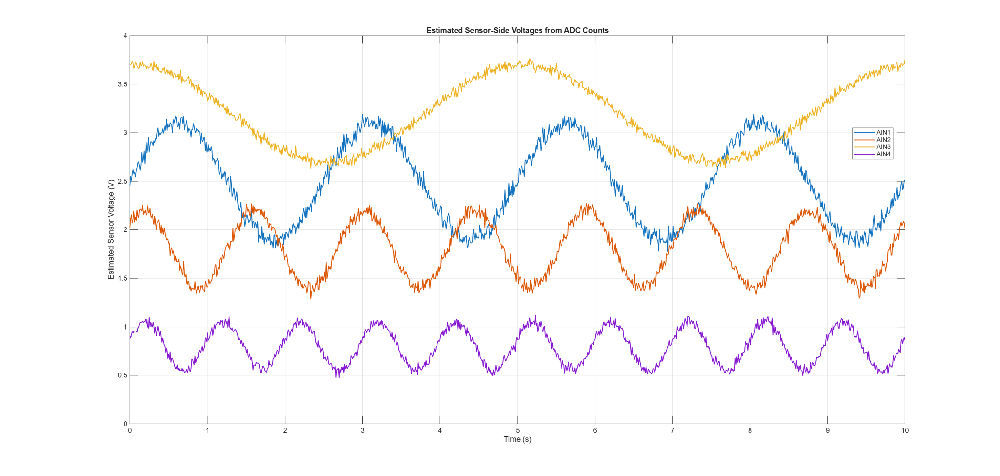
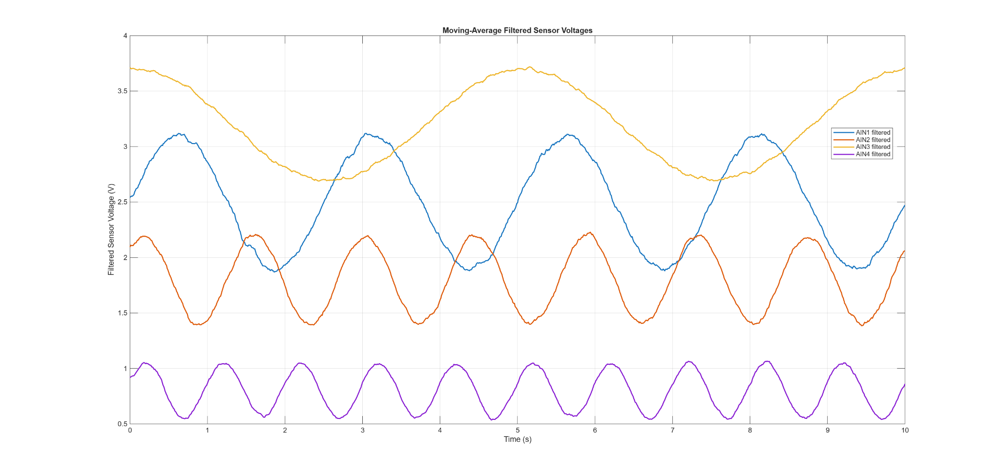
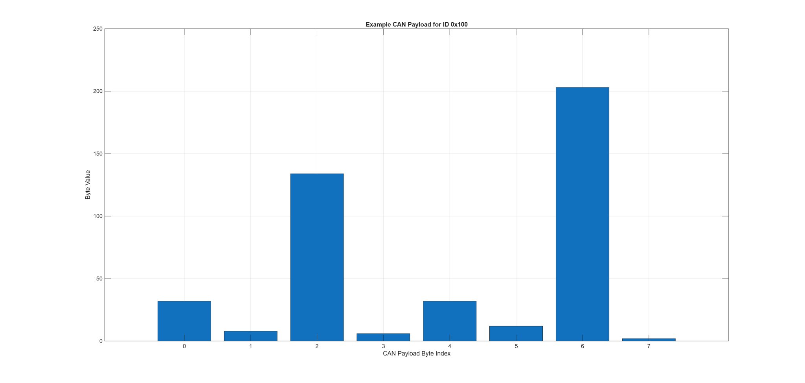
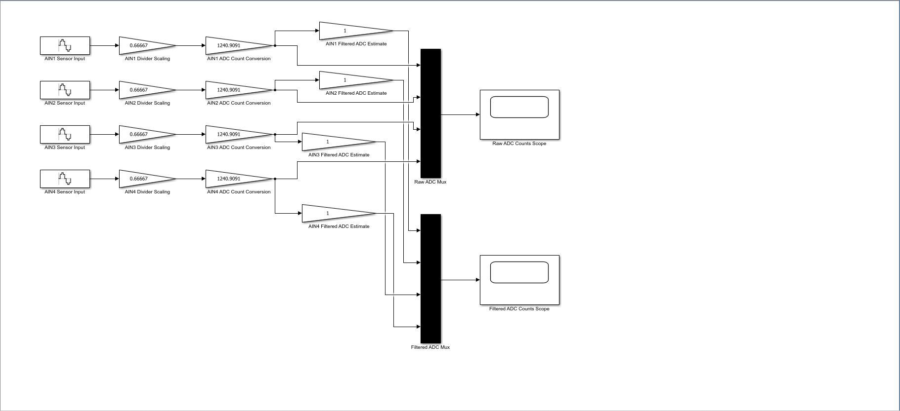
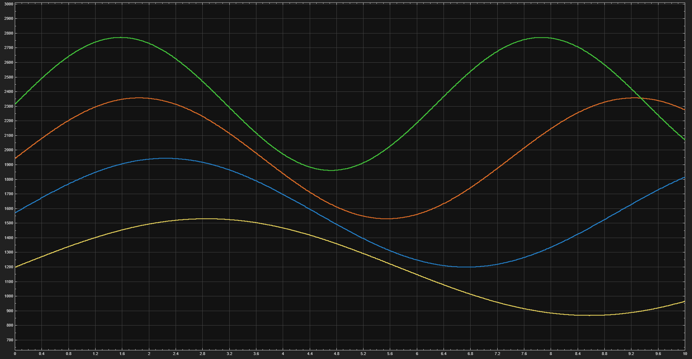
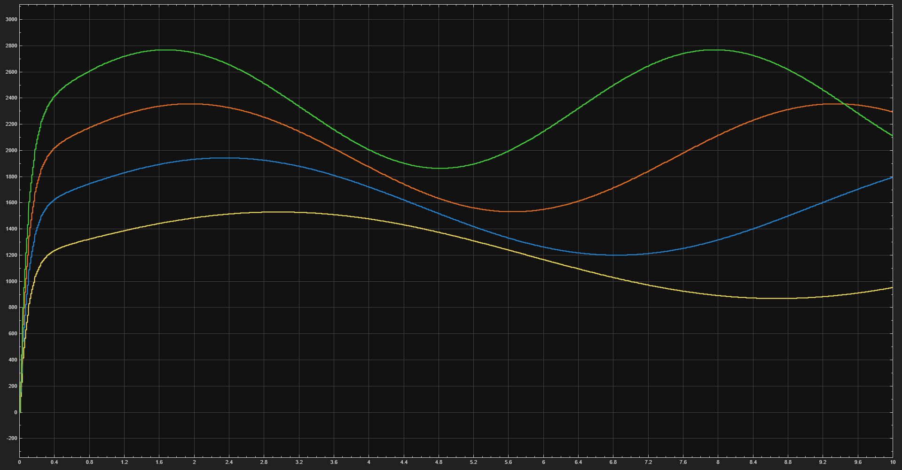

# MATLAB/Simulink Sensor Filtering and CAN Telemetry Simulation

## Overview

This project supports the STM32 CAN Telemetry Node Rev A by modeling the planned analog telemetry signal path before physical hardware bring-up.

The project combines a MATLAB simulation and a Simulink signal-flow model to show how four analog sensor inputs can be scaled, converted into STM32 ADC counts, filtered, and prepared for the planned CAN telemetry frame.

```text
Analog sensor input
  -> resistor-divider scaling
  -> STM32 ADC raw count
  -> filtering / signal conditioning
  -> CAN payload formatting
  -> CAN ID 0x100 telemetry frame
```

This project is part of the larger STM32 CAN Telemetry Node Rev A portfolio project.

## Project Status

This is a simulation and documentation project. It does not claim physical PCB, ADC, or CAN bus validation.

The Rev A PCB has not yet been physically assembled or tested, so these files are intended to support planned firmware bring-up and telemetry validation.

## Folder Structure

```text
MATLAB_Simulink_Telemetry_Simulation/
├── README.md
├── MATLAB/
│   └── adc_can_telemetry_simulation.m
├── Simulink/
│   ├── create_stm32_can_telemetry_model.m
│   └── stm32_can_telemetry_filter_model.slx
├── plots/
│   ├── raw_adc_counts.png
│   ├── estimated_sensor_voltages.png
│   ├── filtered_sensor_voltages.png
│   ├── example_can_payload_bytes.png
│   └── telemetry_simulation_output.csv
├── images/
│   ├── simulink_model_overview.png
│   ├── raw_adc_counts_scope.png
│   └── filtered_adc_counts_scope.png
└── docs/
    └── MATLAB_Simulink_Telemetry_Simulation_Report.pdf
```

## MATLAB Simulation

The MATLAB script is located at:

```text
MATLAB/adc_can_telemetry_simulation.m
```

It performs:

- Synthetic sensor-signal generation for four analog telemetry inputs
- STM32 12-bit ADC scaling using a 3.3 V reference
- Rev A resistor-divider modeling using 10 kOhm / 20 kOhm values
- Sensor-side voltage estimation from ADC counts
- Moving-average filtering
- CAN payload packing for standard ID `0x100`
- Plot and CSV generation

Run in MATLAB:

```matlab
cd MATLAB
adc_can_telemetry_simulation
```

Generated outputs are saved to the `plots/` folder.

## MATLAB Results



**Figure 1.** Simulated raw STM32 ADC counts for four analog telemetry channels.



**Figure 2.** Estimated sensor-side voltages reconstructed from ADC counts using the Rev A resistor-divider model.



**Figure 3.** Moving-average filtered sensor voltage estimates for AIN1-AIN4.



**Figure 4.** Example 8-byte CAN payload for standard ID `0x100`, showing little-endian packing of four raw ADC values.

## Simulink Model

The Simulink model-generation script is located at:

```text
Simulink/create_stm32_can_telemetry_model.m
```

It creates the model:

```text
Simulink/stm32_can_telemetry_filter_model.slx
```

The Simulink model includes:

- Four simulated analog sensor input channels
- Divider scaling blocks
- ADC count conversion blocks
- First-order discrete low-pass filter blocks
- Raw ADC mux and scope
- Filtered ADC mux and scope

Run in MATLAB with Simulink installed:

```matlab
cd Simulink
create_stm32_can_telemetry_model
```

## Simulink Results



**Figure 5.** Simulink signal-flow model showing four telemetry channels, divider scaling, ADC count conversion, discrete low-pass filtering, mux blocks, and scope outputs.



**Figure 6.** Simulink raw ADC counts scope output for the four simulated telemetry channels.



**Figure 7.** Simulink filtered ADC counts scope output after the first-order discrete low-pass filtering stage.

## CAN Payload Format

| CAN ID | DLC | Bytes | Signal | Description |
|---|---:|---|---|---|
| 0x100 | 8 | Byte 0-1 | AIN1_RAW | Raw ADC value from AIN1 |
| 0x100 | 8 | Byte 2-3 | AIN2_RAW | Raw ADC value from AIN2 |
| 0x100 | 8 | Byte 4-5 | AIN3_RAW | Raw ADC value from AIN3 |
| 0x100 | 8 | Byte 6-7 | AIN4_RAW | Raw ADC value from AIN4 |

Each 16-bit ADC value is packed little-endian, with the low byte first and high byte second.

## Connection to STM32 Firmware

The STM32 starter firmware reads AIN1-AIN4, packs the raw ADC values into CAN frame ID `0x100`, and transmits the frame every 100 ms. This MATLAB/Simulink project models that same telemetry path at the software-simulation level before hardware validation.

## Current Limitations

- This project uses simulated sensor data.
- The plots and CSV output are not physical hardware measurements.
- ADC behavior, sensor behavior, CAN transmission, and filtering still need to be validated after Rev A PCB assembly.
- The Simulink model demonstrates the signal path and filtering concept; the embedded implementation will be refined during board bring-up.

## Resume Summary

Developed MATLAB/Simulink telemetry simulations for the STM32 CAN node, modeling ADC scaling, sensor filtering, and CAN ID `0x100` payload formatting before hardware bring-up.
