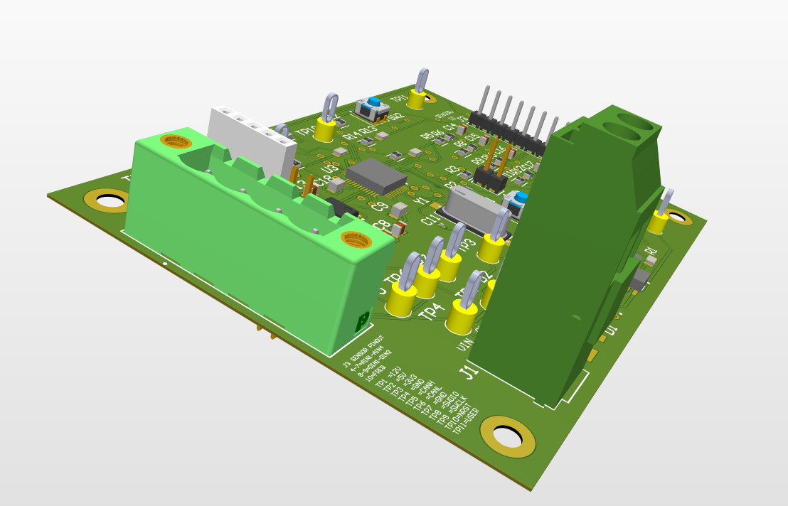
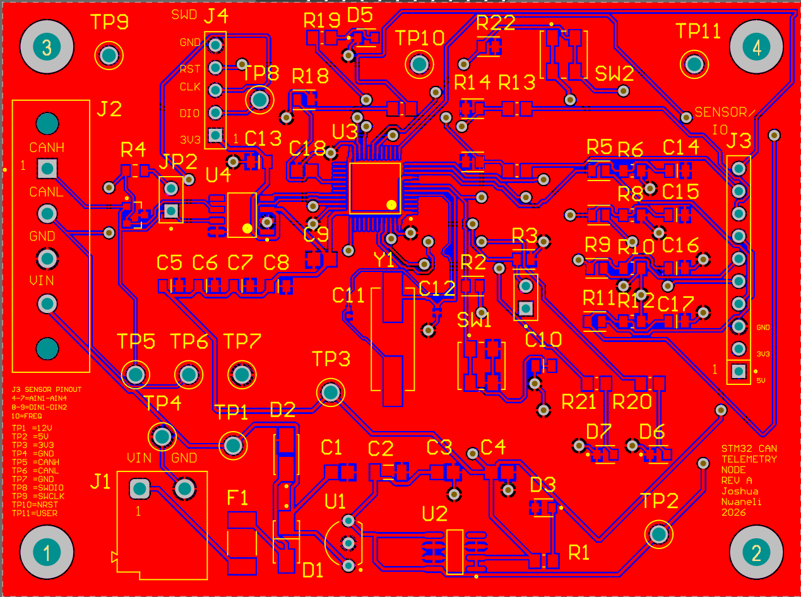
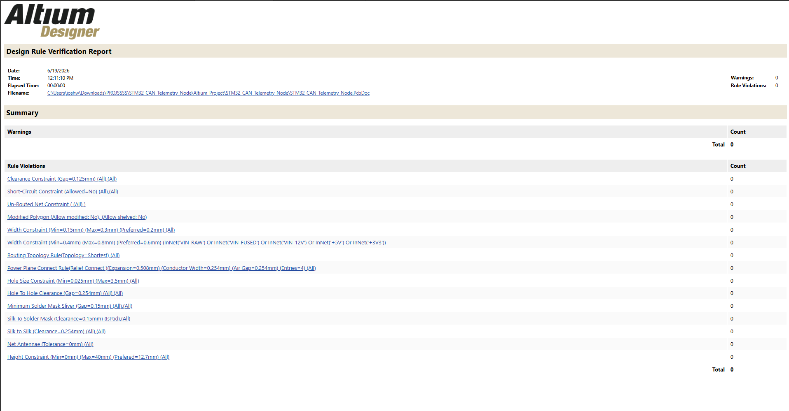

# STM32 CAN Telemetry Node - Rev A

## Overview

The STM32 CAN Telemetry Node is a custom STM32-based telemetry PCB designed in Altium Designer. The board is intended to collect analog, digital, and frequency-based sensor inputs and transmit telemetry data over a CAN bus.

Rev A includes protected 12 V input power, +5 V and +3.3 V regulation, an STM32F103C8T6 microcontroller, CAN transceiver interface, sensor input conditioning, SWD programming access, debug LEDs, test points, and mounting holes.

Physical assembly and firmware bring-up are planned as the next phase.
## Board Preview





## Project Status

- Schematic complete
- PCB layout routed
- Ground pours completed
- DRC passed with 0 warnings, 0 rule violations, and 0 unrouted nets
- Manufacturing outputs generated
- Bring-up and firmware validation planned
- 
## DRC Result



## Key Features

- STM32F103C8T6 microcontroller, LQFP-48
- 12 V input through protected power path
- +5 V and +3.3 V power rails
- CAN transceiver with CANH/CANL connector
- Optional 120 ohm CAN termination jumper
- Four analog inputs with divider/filter networks
- Two digital inputs with pull-down networks
- One frequency/wheel-speed input
- SWD programming/debug header
- Reset and BOOT0 circuitry
- Status, CAN activity, and error LEDs
- User button
- Test points for power, CAN, SWD, reset, and user input
- 90 mm x 67 mm PCB

## System Architecture

```text
12 V Input
  -> Fuse / Protection
  -> 5 V Regulator
  -> 3.3 V Regulator
  -> STM32F103C8T6
  -> CAN Transceiver
  -> CANH / CANL Connector
```

Additional inputs:

```text
Analog Sensors -> Divider/Filter -> STM32 ADC
Digital Inputs -> Pull-down/Series Resistor -> STM32 GPIO
Frequency Input -> Filter/Pull-down -> STM32 Timer Input
SWD Header -> STM32 Programming/Debug
LEDs/Button -> Firmware Bring-up and Debug
```

## Planned CAN Message

| CAN ID | DLC | Bytes | Signal | Description |
|---|---:|---|---|---|
| 0x100 | 8 | Byte 0-1 | AIN1_RAW | Raw ADC value from AIN1 |
| 0x100 | 8 | Byte 2-3 | AIN2_RAW | Raw ADC value from AIN2 |
| 0x100 | 8 | Byte 4-5 | AIN3_RAW | Raw ADC value from AIN3 |
| 0x100 | 8 | Byte 6-7 | AIN4_RAW | Raw ADC value from AIN4 |

Planned CAN bitrate: 500 kbps  
Planned transmit period: 100 ms

## Project Structure

```text
STM32_CAN_Telemetry_Node/
├── Altium_Project/
├── Manufacturing/
│   ├── Gerbers/
│   ├── NC_Drill/
│   ├── BOM/
│   ├── PickPlace/
│   └── DRC/
├── Docs/
│   ├── Design_Report.pdf
│   ├── Bringup_Test_Plan.pdf
│   ├── CAN_Message_Map.xlsx
│   └── Firmware_Starter_Plan.pdf
├── Portfolio_Images/
│   ├── PCB_Top.png
│   ├── PCB_Bottom.png
│   ├── PCB_3D_Render.png
│   └── DRC_Report.png
├── Firmware/
│   └── README.md
└── README.md
```

## Documentation

Main documentation files:

- `Design_Report.pdf` - Full hardware design report
- `Bringup_Test_Plan.pdf` - Step-by-step hardware validation checklist
- `CAN_Message_Map.xlsx` - Planned CAN frame and signal map
- `Firmware_Starter_Plan.pdf` - Planned STM32 firmware bring-up approach

## Planned Firmware

The starter firmware will initialize GPIO, ADC, timer input, and CAN. It will read AIN1-AIN4, pack the raw ADC values into CAN frame ID `0x100`, and transmit the frame every 100 ms. Debug LEDs will be used for heartbeat, CAN activity, and error indication.

Basic planned loop:

```c
while (1)
{
    read_adc_channels();
    read_digital_inputs();
    measure_frequency_input();
    pack_adc_values_into_can_frame();
    send_can_message(0x100);
    delay_ms(100);
}
```

## Future Rev B Improvements

- Physical assembly and validation
- Firmware validation with ADC and CAN transmission
- CAN analyzer testing
- Improved automotive-grade input protection
- USB-C programming/debugging option
- SD card logging
- Enclosure or mounting bracket
- Optional second CAN channel
- More compact layout after Rev A validation

## Author

Joshua Nwaneli  
June 2026
