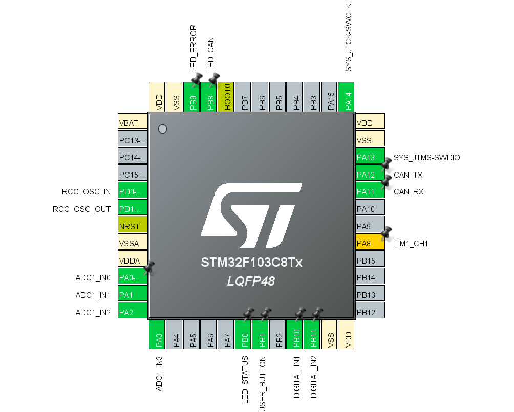
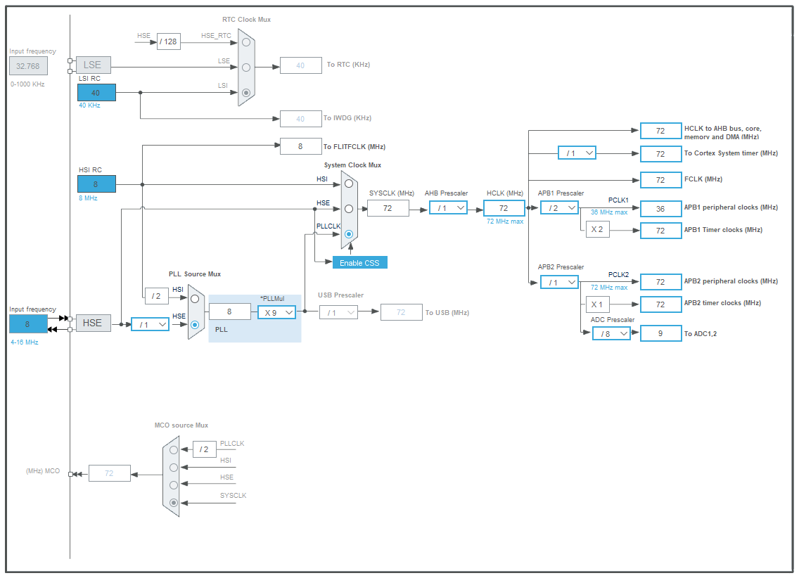
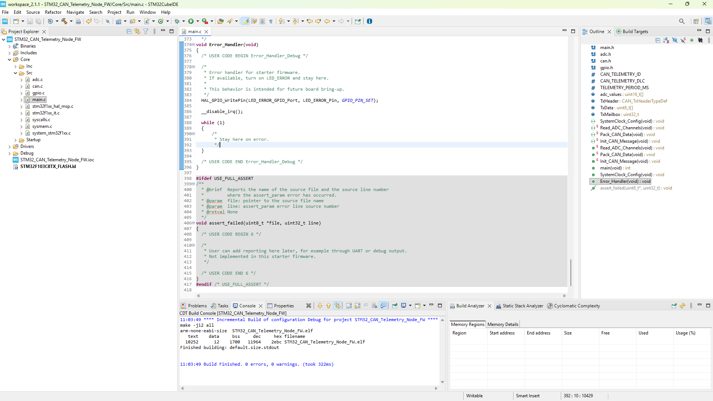

# STM32 CAN Telemetry Node - Rev A

## Overview

The STM32 CAN Telemetry Node is a custom STM32-based telemetry PCB designed in Altium Designer. The board is intended to collect analog, digital, and frequency-based sensor inputs and transmit telemetry data over a CAN bus.

Rev A includes protected 12 V input power, +5 V and +3.3 V regulation, an STM32F103C8T6 microcontroller, CAN transceiver interface, sensor input conditioning, SWD programming access, debug LEDs, test points, and mounting holes.

The hardware design is complete, routed, DRC-clean, and prepared for manufacturing. A starter STM32CubeMX / STM32CubeIDE firmware framework has also been created and currently builds with 0 errors. Physical assembly and hardware validation are planned as the next phase.

## Board Preview


## Project Status

- Schematic complete
- PCB layout routed
- Ground pours completed
- DRC passed with 0 warnings, 0 rule violations, and 0 unrouted nets
- Manufacturing outputs generated
- STM32CubeMX / STM32CubeIDE starter firmware created
- Firmware builds with 0 errors
- Physical assembly, board bring-up, ADC validation, and CAN bus testing planned

## DRC Result


## Key Features

- STM32F103C8T6 microcontroller, LQFP-48
- 12 V input through protected power path
- +5 V and +3.3 V power rails
- SN65HVD230-style 3.3 V CAN transceiver interface
- CANH/CANL connector
- Optional 120 ohm CAN termination jumper
- Four analog inputs with divider/filter networks
- Two digital inputs with pull-down networks
- One frequency/wheel-speed input
- SWD programming/debug header
- Reset and BOOT0 circuitry
- Status, CAN activity, and error LEDs
- User button
- Test points for power, CAN, SWD, reset, and user input
- 90 mm x 67 mm PCB

## System Architecture

```text
12 V Input
  -> Fuse / Protection
  -> 5 V Regulator
  -> 3.3 V Regulator
  -> STM32F103C8T6
  -> CAN Transceiver
  -> CANH / CANL Connector
```

Additional inputs:

```text
Analog Sensors -> Divider/Filter -> STM32 ADC
Digital Inputs -> Pull-down/Series Resistor -> STM32 GPIO
Frequency Input -> Filter/Pull-down -> STM32 Timer Input
SWD Header -> STM32 Programming/Debug
LEDs/Button -> Firmware Bring-up and Debug
```

## Planned CAN Message

| CAN ID | DLC | Bytes | Signal | Description |
|---|---:|---|---|---|
| 0x100 | 8 | Byte 0-1 | AIN1_RAW | Raw ADC value from AIN1 |
| 0x100 | 8 | Byte 2-3 | AIN2_RAW | Raw ADC value from AIN2 |
| 0x100 | 8 | Byte 4-5 | AIN3_RAW | Raw ADC value from AIN3 |
| 0x100 | 8 | Byte 6-7 | AIN4_RAW | Raw ADC value from AIN4 |

Planned CAN bitrate: 500 kbps  
Planned transmit period: 100 ms

## Firmware Status

A starter STM32CubeMX / STM32CubeIDE firmware framework has been added for planned ADC-to-CAN telemetry bring-up. The firmware configures GPIO, ADC, CAN message packing, and a 100 ms transmit loop for CAN ID `0x100`.

Current firmware status:

- STM32CubeMX configuration created for STM32F103C8T6 / STM32F103C8Tx
- SWD debug enabled
- HSE configured for the external 8 MHz crystal
- ADC1 configured for PA0-PA3 analog inputs
- CAN configured on PA11 / PA12 for planned 500 kbps operation
- CAN payload structure matches the project message map
- Starter firmware builds with 0 errors
- Hardware validation is planned after Rev A PCB assembly

The firmware should be treated as starter firmware until the PCB is assembled and tested. ADC readings, CAN transmission, and LED behavior have not yet been verified on physical hardware.

## Firmware Configuration and Build

The starter firmware was configured in STM32CubeMX and generated for STM32CubeIDE. The project currently builds with 0 errors.







## Project Structure

```text
STM32_CAN_Telemetry_Node/
├── Altium_Project/
├── Manufacturing/
│   ├── Gerbers/
│   ├── NC_Drill/
│   ├── BOM/
│   ├── PickPlace/
│   └── DRC/
├── Docs/
│   ├── Design_Report.pdf
│   ├── Bringup_Test_Plan.pdf
│   ├── CAN_Message_Map.xlsx
│   └── Firmware_Starter_Plan.pdf
├── Portfolio_Images/
│   ├── STM32_CAN_Telemetry_Node_3D_Angled.png
│   ├── STM32_CAN_Telemetry_Node_Top_2D.png
│   ├── DRC.png
│   ├── STM32CubeMX_Pinout.png
│   ├── STM32CubeMX_Clock_Config.png
│   └── STM32CubeIDE_Build_Success.png
├── Firmware/
│   ├── README.md
│   └── STM32_CAN_Telemetry_Node_FW/
└── README.md
```

## Documentation

Main documentation files:

- `Design_Report.pdf` - Full hardware design report
- `Bringup_Test_Plan.pdf` - Step-by-step hardware validation checklist
- `CAN_Message_Map.xlsx` - Planned CAN frame and signal map
- `Firmware_Starter_Plan.pdf` - Planned STM32 firmware bring-up approach

## Starter Firmware Main Loop

The starter firmware reads AIN1-AIN4, packs the raw ADC values into CAN frame ID `0x100`, and transmits the frame every 100 ms. Debug LEDs are included for planned heartbeat, CAN activity, and error indication.

Basic starter loop:

```c
while (1)
{
    Read_ADC_Channels();
    Pack_CAN_Data();

    HAL_CAN_AddTxMessage(&hcan, &TxHeader, TxData, &TxMailbox);

    HAL_GPIO_TogglePin(LED_STATUS_GPIO_Port, LED_STATUS_Pin);
    HAL_Delay(100);
}
```

## Current Limitations

Because the Rev A PCB has not been assembled yet, the following items are still planned:

- Flashing firmware to physical hardware
- Verifying 3.3 V and 5 V rails before programming
- Confirming SWD connection
- Testing LED behavior
- Measuring ADC readings from real sensor inputs
- Verifying CAN transmission with a CAN analyzer
- Validating CAN bitrate and bus termination
- Testing error handling during board bring-up

## Future Rev B Improvements

- Physical assembly and validation
- Firmware validation with ADC and CAN transmission
- CAN analyzer testing
- Improved automotive-grade input protection
- USB-C programming/debugging option
- SD card logging
- Enclosure or mounting bracket
- Optional second CAN channel
- More compact layout after Rev A validation

## Author

Joshua Nwaneli  
June 2026
