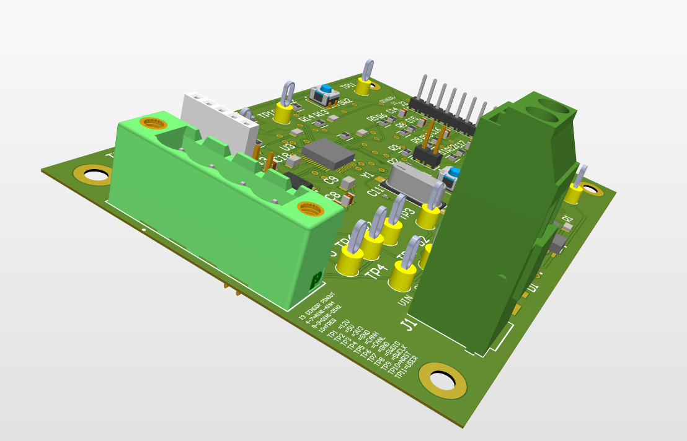
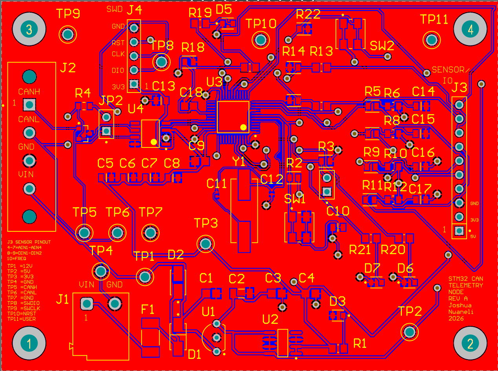
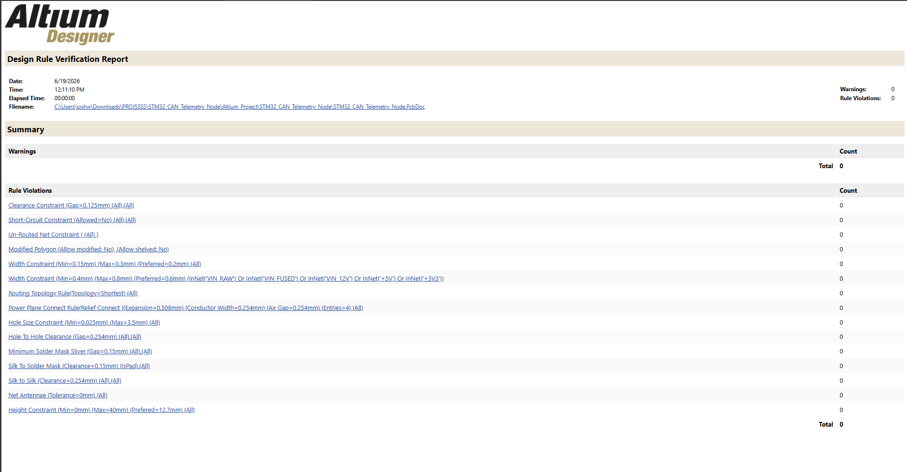

# WindBorne Electrical Engineer Intern — PCB Submission

## STM32 CAN Telemetry Node

I designed this STM32F103-based telemetry PCB in Altium Designer to acquire vehicle sensor data and transmit it over a CAN bus.

The board includes:

- Protected 12 V input power
- 5 V and 3.3 V regulation
- STM32F103C8T6 microcontroller
- CAN transceiver interface
- Four analog sensor inputs
- Digital and frequency inputs
- SWD programming/debug access
- Status, CAN activity, and error LEDs
- Test points for power, CAN, reset, and debugging

The PCB layout is complete, passes Altium DRC with 0 rule violations and 0 unrouted nets, and includes manufacturing outputs such as Gerbers, drill files, BOM, and pick-and-place files.

## A Design Feature I Like

One small feature I particularly like is the selectable 120-ohm CAN termination.

The termination resistor can be enabled with a jumper when the telemetry node is located at the end of the CAN bus, or disabled when the board is used elsewhere on the network.

This allows the same PCB to support multiple physical positions on the CAN network without modifying or redesigning the board.

## PCB

## PCB Layout

## Schematic

[View Full Schematic](Portfolio_Images/STM32_CAN_Telemetry_Node_Schematic.PDF)

## Design Rule Check

The complete project, including Altium design files, manufacturing outputs, firmware starter code, CAN message map, and bring-up documentation, is available in this repository.
